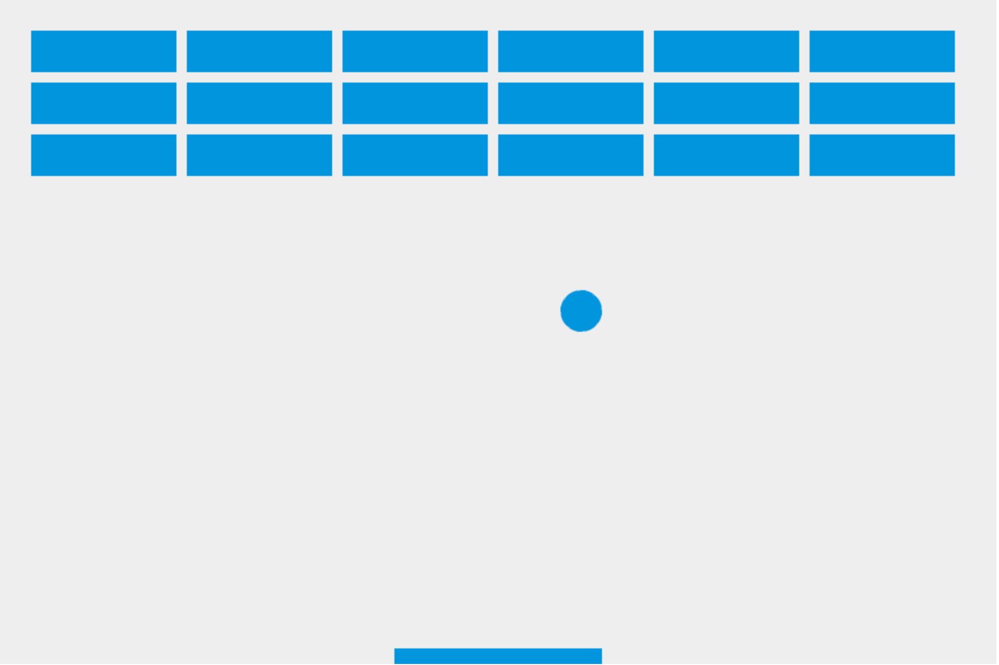

# 2d Breakout Javascript

This is a 2D Breakout Game, developed using vanilla Javascript (ES6).

Besides the game itself, there are 2 other goals:

1. Use Babel to transpile code from ES6 to ES5 for browser compatibility.
1. Create a Github page after the game is at a presentable alpha stage.
