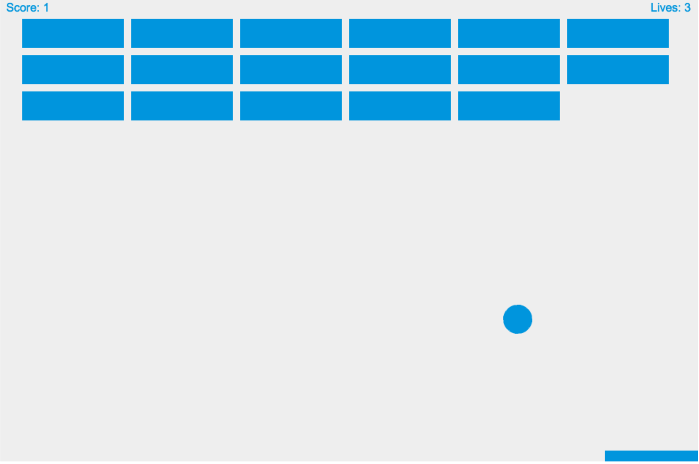

# 2D Breakout Javascript

This is a 2D Breakout Game, developed using vanilla Javascript (ES6).

[Play it here!](http://charliegdev.github.io/2d-breakout-javascript)



## Tutorial

This game development follows the tutorial on [MDN 2D Breakout Game Using Pure JavaScript](https://developer.mozilla.org/en-US/docs/Games/Tutorials/2D_Breakout_game_pure_JavaScript). There are some modifications, mainly:

1. I used ECMAScript 6 instead of the currently widely used ECMAScript 5.
1. Naturally, there are many browser compatibility issue caused by ES 6; I used Babel to transpile source code to ES 5.1.
1. To make use of Babel CLI, I converted this repository to a NodeJS repository as well.

## NodeJS & Babel

If you just want to play this game, simply click the play link at the top.

However if you want to fork/download, and modify the code, here are some details you need to know:

Script I wrote is inside `scripts.js`; however Babel transpiled it into ES 5.1 and put all output inside `prod.js`. `index.html` uses `prod.js` instead of `scripts.js`.

First, do

```npm install```

inside root directory; `npm`, which is NodeJS' package management software, will read `package.json` in root directory, and install all development dependencies. Depending on your machine, you might need to install npm first.

Then, type this your terminal:

```node_modules/.bin/babel scripts.js --watch --out-file prod.js```

This will start Babel in "watch" mode; any change made to `scripts.js` will be reflected to `prod.js`, so you don't have to manually transpile.

